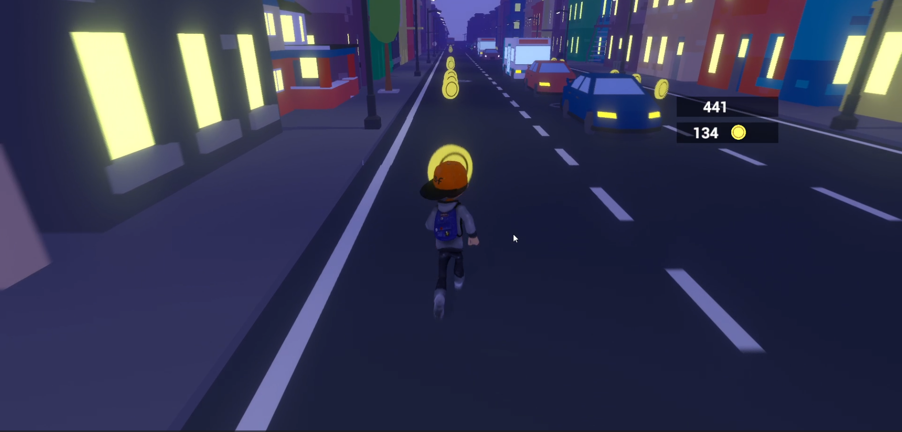
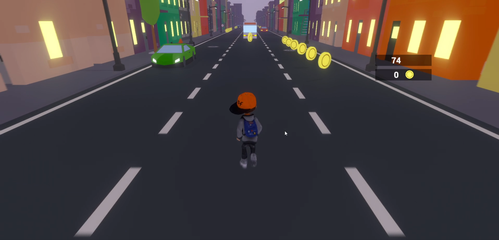

# Traffic Runner

An endless lane-switching runner built to learn Unity and game development workflows.

## About The Game

Traffic Runner is a 3D endless runner set in a lively city environment where traffic never stops.

**Download the game:** [Traffic Runner on itch.io](https://venom7784.itch.io/traffic-runner) – get the build and play!

Cars rush toward you as you sprint forward, and your objective is simple:

- Switch lanes.
- Avoid collisions.
- Collect coins.
- Survive as long as possible.

The game features a dynamic day and night cycle, creating a visually engaging experience as you run through the city streets.

This was my first fully completed Unity game, created primarily as a learning project to understand Unity’s systems, workflows, and game development fundamentals.

## Features

- Incoming traffic obstacles
- Smooth lane-switching movement
- Coin collection system
- Dynamic day and night cycle
- Stylized low-poly city environment
- Score tracking system
- Third-person camera setup

## How To Play

- **Move Left / Right:** Switch lanes
- **Objective:** Avoid cars and survive as long as possible
- **Collect Coins:** Increase your score

The longer you survive, the higher your score.

## Purpose of This Project

This project was created to:

- Learn Unity fundamentals
- Understand player movement systems
- Work with prefabs and asset integration
- Implement obstacle spawning
- Experiment with lighting and environment design
- Complete and publish a full game project

While the game is not heavily polished, it represents an important milestone in my game development journey — finishing and shipping my first complete game.

## Future Improvements

- More power-ups
- Coin-based upgrades
- More traffic variety
- UI improvements and polish

## Screenshots

_Snapshots from the `Game_Screenshots` folder in the repo._

## Built With

- Unity
- Free / Store Assets
- Custom gameplay logic
